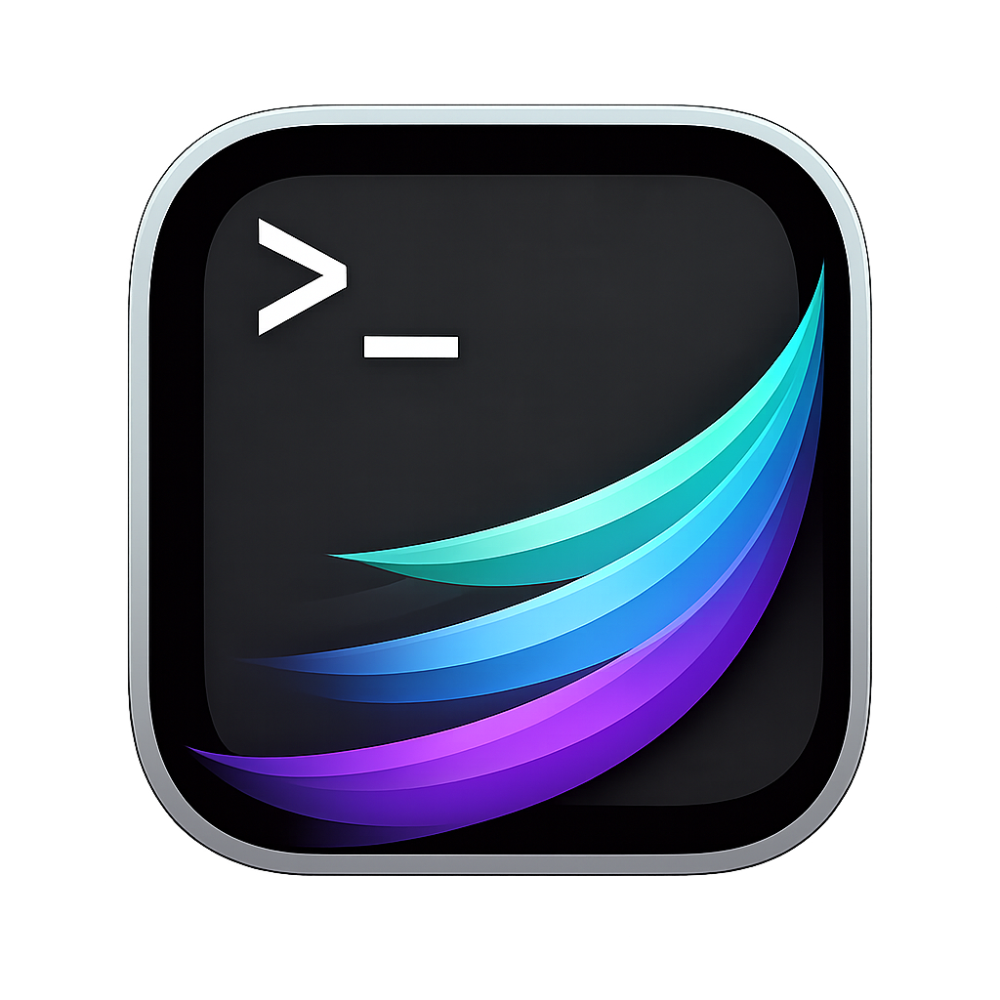
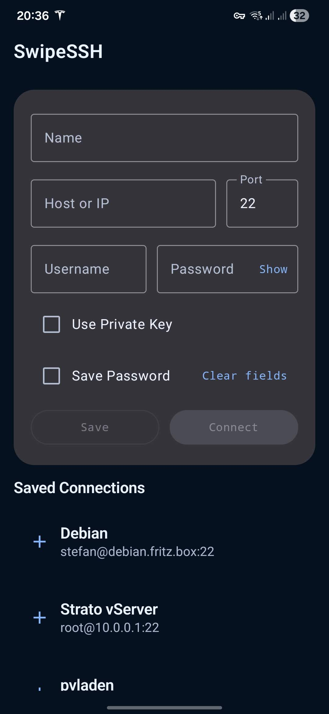
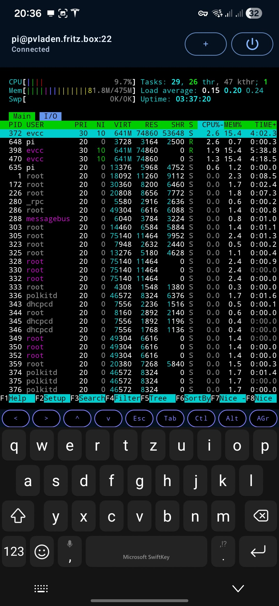
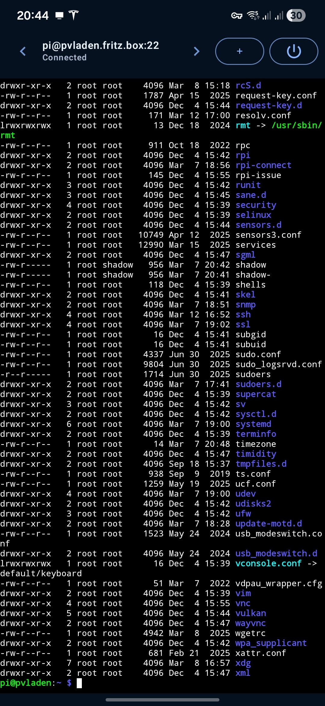

# SwipeSSH

  

SwipeSSH is a lightweight SSH client for Android focused on a smooth multi-session workflow.
Sessions stay active while you switch between them, and you can quickly move between terminals by swiping on the connection title bar. Connection settings can be stored for reuse, and the terminal supports full ANSI features.

## Screenshots

  
  
  

## Features

- Swipe between multiple SSH sessions on the connection title bar
- Sessions remain active in the background
- Store and reuse connection settings
- Full ANSI terminal support
- Host key verification

Free, open source, no ads.

## Building

This is a standard Android Studio / Gradle project.

1. Open the project in Android Studio.
2. Sync Gradle.
3. Build the debug or release variant.

## License

SwipeSSH is released under the GNU General Public License v3.0 (GPL-3.0).

Third-party components used by this project include:

- Vendored terminal code from the Termux `terminal-emulator` and `terminal-view` libraries, used under the Apache License 2.0
- SSH transport via `sshj`, used under the Apache License 2.0
- Bouncy Castle cryptography provider (`bcprov-jdk18on`), used under its upstream permissive license terms

See `LICENSE` and `THIRD_PARTY_NOTICES.md`.

